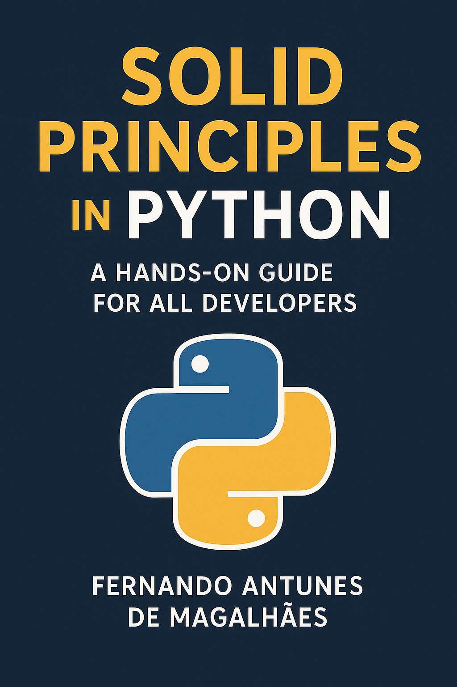
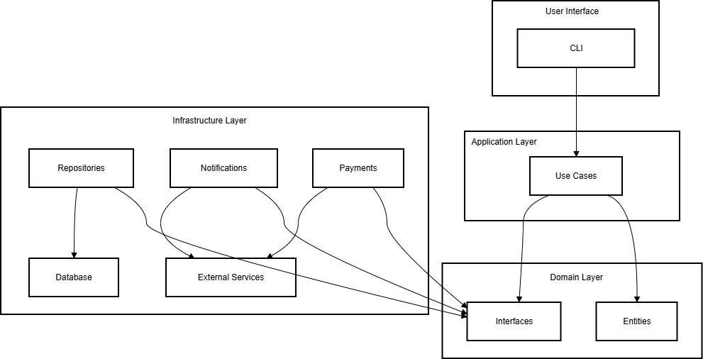

# ShopFlow: A SOLID & Clean Architecture Example in Python

<p align="center">
  
</p>

A real-world example demonstrating SOLID principles and Clean Architecture in Python, built specifically for the book  
**["SOLID Principles in Python: A Hands-On Guide for All Developers"](https://a.co/d/bV2MkGJ)**  
by **Fernando Antunes de Magalhães**.

---

## What is ShopFlow?

ShopFlow is a minimal yet realistic order-processing system designed to illustrate how core software design principles translate into clean, maintainable, and testable code. Unlike toy examples, ShopFlow models a cohesive slice of a real e-commerce backend—including order creation, inventory checks, payment processing, and SMS/E-mail notifications and strictly adhering to:

- SOLID design principles  
- Clean Architecture layering (`domain`, `application`, `infrastructure`)  
- Explicit dependency inversion and interface segregation  
- Full testability with `pytest`

This project serves as a companion to the book, showing both correct implementations and common violations, with clear explanations of why design choices matter in practice.

---
## Architecture

### Application Architecture

This diagram illustrates the high-level structure of the ShopFlow application.

 

---

## Getting Started

### 1. **Activate your virtual environment (recommended)**

To keep dependencies isolated, create and activate a virtual environment:

**Windows (PowerShell):**
```powershell
python -m venv .venv
.\.venv\Scripts\Activate.ps1
```

**macOS / Linux:**
```bash
python3 -m venv .venv
source .venv/bin/activate
```

> 💡 You’ll see `(.venv)` in your prompt when active.

---

### 2. **Install dependencies**

The only external dependency is `pytest` (for testing). Install it via:

```bash
pip install -r requirements.txt
```

---

### 3. **Run the application**

Execute the main script:

```bash
python main.py
```

On first run, the system automatically creates a SQLite database file:  
**`shopflow.db`**

This file stores:
- Sample products (`Laptop`, stock: 10)  
- A test customer (`cust_123`, email: `user@example.com`)  
- Any orders you place during testing

> **Want to inspect the data?**  
> Open `shopflow.db` with [DB Browser for SQLite](https://sqlitebrowser.org/) (free and open-source).

---

### 4. **Run the tests**

All tests are isolated and fast (no real DB or email):

```bash
python -m pytest tests/
```

> Always use `python -m pytest` (not just `pytest`) to ensure correct package resolution.

---

## About the Book

**"SOLID Principles in Python: A Hands-On Guide for All Developers"** is a practical guide for developers at any level who want to write robust, scalable, and maintainable Python applications. Through realistic examples like ShopFlow, the book bridges theory and practice, helping you recognize anti-patterns, refactor legacy code, and build systems that evolve gracefully.

**Perfect for**:  
- Python developers tired of “tutorial hell”  
- Engineers transitioning from Java/C#  
- Teams adopting Clean Architecture  
- Anyone who believes **clean code is a professional responsibility**

**Get the book**: https://a.co/d/bV2MkGJ

---

## License

© 2025 Fernando Antunes de Magalhães  
For educational and reference use. Code may be reused with attribution.

---
## 👤 Maintained By
This project is developed and maintained by **Fernando Antunes de Magalhães Desenvolvimento de Software Ltda.**

**Fernando Magalhães**  
CEO – FM ByteShift Software  
📞 (21) 97250-1546  
✉️ [contact@fmbyteshiftsoftware.com](mailto:contact@fmbyteshiftsoftware.com)  
🌐 [fmbyteshiftsoftware.com](https://fmbyteshiftsoftware.com)  
🏢 CNPJ: 62.145.022/0001-05 (Brazil)