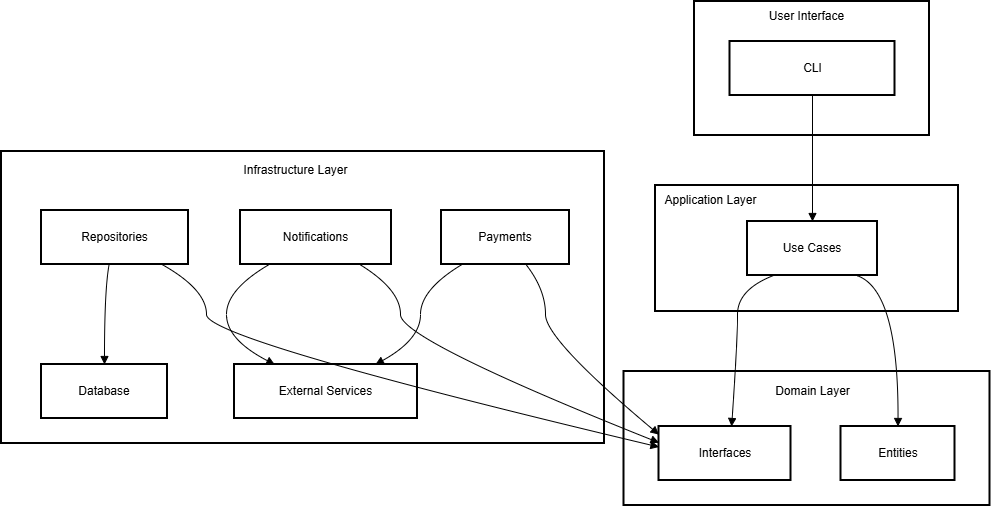

# ShopFlow

## Solution Overview & Architecture

<p align="center">
  
</p>

---

## Quick Summary (30-second read)

**What:** Real-world order-processing system demonstrating SOLID principles and Clean Architecture in Python  
**Why:** Bridges software engineering theory and production practice for Python developers  
**How:** Practical implementation of SOLID, Clean Architecture, and testable design patterns  
**Status:** Educational reference implementation, companion to published book  
**Book:** "SOLID Principles in Python: A Hands-On Guide for All Developers"  
**GitHub:** github.com/python-projects-fernando/shopflow

_Continue reading for more details and methodology._

---

## Key Takeaways for Decision Makers

✓ **Practical reference:** Real-world example, not abstract theory or toy code  
✓ **Educational value:** Companion to published book with clear explanations  
✓ **Production patterns:** Clean Architecture, dependency inversion, interface segregation  
✓ **Fully testable:** Comprehensive pytest suite with isolated unit tests  
✓ **Transparent design:** Both correct implementations and common violations documented

---

## Value Proposition

**Educational reference implementation** that demonstrates how SOLID principles and Clean Architecture translate into clean, maintainable, testable Python code.

Built for **Python developers, engineering teams, and technical leaders** who want to move beyond tutorial hell and understand how design principles apply in practice.

**Key Benefits:**

- Realistic order-processing system modeling e-commerce backend workflows
- Clear demonstration of SOLID principles with before/after comparisons
- Clean Architecture layering (domain, application, infrastructure)
- Full testability with pytest and isolated unit tests (no real DB or email)
- Explicit dependency inversion and interface segregation patterns

---

## Business Impact & Expected Outcomes

### Measurable Value for Your Organization

| Metric                   | Target Impact            | Why It Matters                                                          |
| ------------------------ | ------------------------ | ----------------------------------------------------------------------- |
| **Code Maintainability** | Improved structure       | Clean Architecture reduces technical debt and simplifies future changes |
| **Developer Onboarding** | Faster ramp-up           | Clear patterns and documentation accelerate team understanding          |
| **Test Coverage**        | Comprehensive unit tests | Isolated tests enable confident refactoring and regression prevention   |
| **Design Quality**       | SOLID adherence          | Reduces coupling and improves long-term code evolution                  |

### Core Features That Deliver Value

- Order creation with inventory validation
- Payment processing with explicit dependency injection
- SMS and email notifications via interface segregation
- Customer and product domain entities with clear boundaries
- SQLite database with repository pattern abstraction
- Comprehensive pytest test suite with isolated units

---

## Our Approach: Educational Reference Implementation

### Why This Matters for Your Project

ShopFlow is an **educational reference implementation** demonstrating how SOLID principles, Clean Architecture, and modern Python practices deliver real business value through maintainable, testable code.

**Result:** When you engage for implementation or consulting, you receive guidance based on proven patterns, reducing risk, rework, and long-term maintenance cost.

### Core Design Principles

| Principle                 | Business Benefit                                           |
| ------------------------- | ---------------------------------------------------------- |
| **SOLID Principles**      | Reduces coupling, improves testability and maintainability |
| **Clean Architecture**    | Core logic independent of frameworks and databases         |
| **Dependency Inversion**  | Easy to swap implementations without rewriting core logic  |
| **Interface Segregation** | Focused contracts reduce unnecessary dependencies          |
| **Test-Driven Design**    | Comprehensive tests enable confident refactoring           |

---

## Solution Architecture Overview

### High-Level Design



### Why This Architecture Delivers Value

**Clean Architecture** was implemented because it:

- **Reduces long-term cost:** Core business logic independent of frameworks and databases
- **Accelerates testing:** Isolated domain rules enable reliable automated testing
- **Supports education:** Clear boundaries simplify teaching design principles
- **Future-proofs investment:** Easy to swap infrastructure without rewriting core logic

_For technical readers: Detailed code examples and explanations available in the published book._

---

## Technology Stack (Educational Reference)

| Category            | Technology                                      | Rationale                                                    |
| ------------------- | ----------------------------------------------- | ------------------------------------------------------------ |
| **Language**        | Python 3.11+                                    | Strong typing, rich ecosystem, enterprise adoption           |
| **Architecture**    | Clean Architecture                              | Separation of concerns (domain, application, infrastructure) |
| **Database**        | SQLite                                          | Lightweight, no external dependencies, ideal for learning    |
| **Testing**         | pytest                                          | Comprehensive unit and integration test coverage             |
| **Design Patterns** | SOLID, Dependency Injection, Repository Pattern | Industry-standard patterns for maintainable code             |

_All choices documented in the published book "SOLID Principles in Python"._

---

## Project Status

**Current Phase:** Educational Reference Implementation  
**Maturity:** Functional, complete order-processing workflow implemented and tested  
**Transparency:** Full codebase available on GitHub with book companion

**What This Means for You:**  
This is not a production SaaS product, it's an educational reference implementation demonstrating production-grade patterns for Python development. When you engage for consulting or implementation, you receive guidance based on validated, documented patterns, not theory.

---

## Get in Touch

**Developed by FM ByteShift Software**

**Fernando Magalhães**  
Founder & Lead Architect  
Author of "SOLID Principles in Python: A Hands-On Guide for All Developers"  
Email: contact@fmbyteshiftsoftware.com  
Website: fmbyteshiftsoftware.com  
GitHub: github.com/python-projects-fernando/shopflow  
Book: Available on Amazon

---

## Technical Appendix (Optional Deep-Dive)

_For technical stakeholders who want implementation details._

### Clean Architecture: Component Breakdown

**Core Layers:**

- **Domain:** Core business entities and rules (Order, Product, Customer, Payment)
- **Application:** Business logic orchestrators (Use Cases) and service interfaces
- **Infrastructure:** Database (SQLite), notification services (SMS/Email), repositories

**Domain Entities:**

- **Order:** Order creation with inventory validation and payment processing
- **Product:** Product entity with stock management
- **Customer:** Customer entity with contact information
- **Payment:** Payment processing with explicit dependency injection

**Key Principles Applied:**

- Dependencies point inward (Dependency Inversion)
- Core logic has zero framework dependencies
- External concerns isolated for easy testing and replacement
- Domain model aligned with e-commerce business requirements

### SOLID Principles Demonstrated

- **Single Responsibility:** Each class has one reason to change
- **Open/Closed:** Open for extension, closed for modification
- **Liskov Substitution:** Subtypes can replace base types without breaking behavior
- **Interface Segregation:** Focused interfaces reduce unnecessary dependencies
- **Dependency Inversion:** Depend on abstractions, not concretions

### Testing Strategy

- **Unit Tests:** pytest for domain logic and use cases
- **Isolation:** No real database or email dependencies in tests
- **Fast Execution:** All tests run quickly for immediate feedback
- **Comprehensive Coverage:** Core business logic fully tested

### How to Run

**Activate virtual environment:**

```bash
python -m venv .venv
source .venv/bin/activate  # macOS/Linux
```

**Install dependencies:**

```bash
pip install -r requirements.txt
```

**Run the application:**

```bash
python main.py
```

**Run the tests:**

```bash
python -m pytest tests/
```

_All components follow SOLID principles and Clean Architecture patterns._

---

_This document reflects the current state of the ShopFlow educational reference implementation. All patterns and decisions are documented in the published book "SOLID Principles in Python"._
